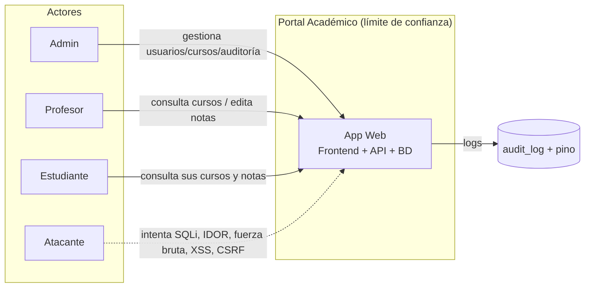
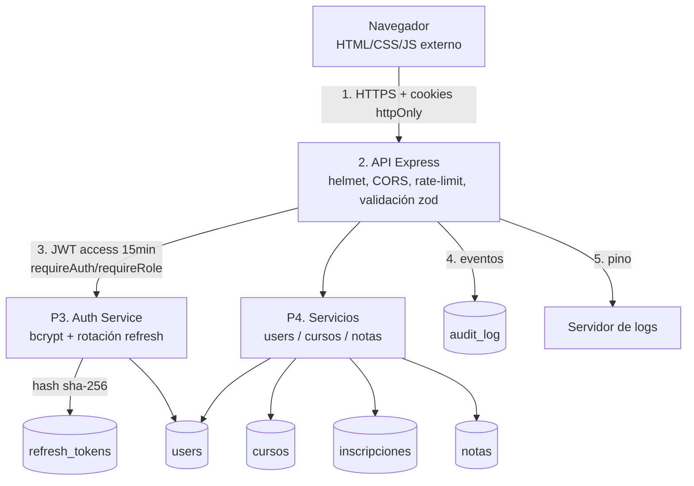

# Modelado de amenazas: DFD + STRIDE

## 1. DFD Nivel 0 (contexto)

Frontera de confianza: el navegador es **no confiable**; toda validación y
autorización ocurre en el servidor. La BD solo acepta prepared statements.

## 2. DFD Nivel 1 (procesos y almacenes)

Flujos de datos sensibles (notas, datos personales) siempre filtrados por el
id de sesión del token (`req.user.id`); el cliente nunca decide a qué datos
accede.

## 3. Tabla STRIDE (mínimo 8 amenazas)

| # | Activo | Amenaza | Categoría STRIDE | Contramedida planificada | Archivo(s) |
|---|---|---|---|---|---|
| 1 | Credenciales (login) | Fuerza bruta / credential stuffing | D (Denegación) / E | Rate limit 5/min en login; mensajes genéricos; bcrypt cost 12 | `middleware/security.js`, `services/auth.service.js` |
| 2 | Cuentas de usuario | Enumeración (existencia por mensaje o timing) | I (Divulgación) | Mensaje único "Credenciales inválidas"; comparación con hash dummy en tiempo constante | `services/auth.service.js`, `utils/crypto.js` |
| 3 | Base de datos | Inyección SQL en login/búsquedas | T (Manipulación) | 100% prepared statements (`?`/`@`); validación zod; sin concatenación | `db/schema.sql`, `services/*.js`, `schemas.js`, `tools/semgrep.yaml` |
| 4 | Notas de estudiantes | IDOR: leer/editar notas ajenas manipulando ids | E (Elevación) | Filtrar siempre por `req.user.id`; `assertProfessorOwnsCourse`; RBAC | `services/grade.service.js`, `services/course.service.js`, `middleware/auth.js` |
| 5 | Sesiones (JWT/cookies) | Robo de token vía XSS | I / E | Cookies `httpOnly`, `SameSite=Strict`, `Secure` en prod; access de 15 min; refresh rotativo y hasheado | `utils/http.js`, `utils/jwt.js`, `services/auth.service.js` |
| 6 | Sesiones | CSRF en acciones mutantes | S (Suplantación) | `SameSite=Strict` + verificación de `Origin` en POST/PUT/PATCH/DELETE | `middleware/security.js` |
| 7 | Frontend | XSS almacenado (nombres, descripciones) | T | CSP `default-src 'self'` sin `unsafe-inline`; `escapeHtml` en todo render | `middleware/security.js`, `public/js/api.js` |
| 8 | API | Abuso de búsquedas / scraping de datos sensibles | D | Rate limit 30/min en búsquedas; autenticación obligatoria | `middleware/security.js`, `routes/users.routes.js` |
| 9 | Configuración | Secretos por defecto / HTTP en producción | I | Validación de env (falla en prod sin secretos); HSTS; redirect a HTTPS; `Secure` | `config/env.js`, `src/app.js` |
| 10 | Trazabilidad | Repudio de acciones (admin niega cambios) | R (Repudio) | `audit_log` con user_id, IP, user-agent, acción, entidad, resultado + pino | `services/audit.service.js`, `db/schema.sql` |
| 11 | Errores | Fuga de información (stack, usuarios existentes) | I | Handler centralizado; genéricos en prod; 404 JSON | `middleware/errorHandler.js` |
| 12 | Contraseñas en reposo | Volcado de BD expone credenciales/sesiones | I | bcrypt cost 12; refresh solo como hash sha-256; nunca `password_hash` en JSON | `utils/crypto.js`, `services/auth.service.js` |
